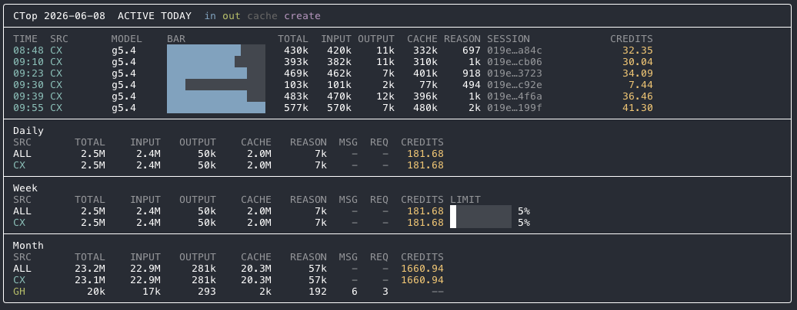

# ctop

> Real-time usage dashboard for OpenAI Codex and GitHub Copilot CLI.

`ctop` lets you answer questions like:

- **How many credits have I burned today?**
- **Which session used the most tokens?**
- **Am I accidentally spending millions of tokens?**
- **How much cache reuse am I getting?**
- **Which model is currently active?**

Unlike batch reporting tools, `ctop` provides a **live terminal dashboard** with session-level statistics and rolling totals.

---

## Features

- ⚡ Live updating dashboard
- 📈 Daily, weekly and monthly totals
- 🔥 Active session detection
- 🤖 Model information
- 💾 Cache create/read statistics
- 💳 Credit tracking (not actual cost)
- 🎨 Colorized terminal output
- 🍎 Linux and macOS support (Windows coming)
- 🚧 GitHub Copilot CLI support (experimental)

---

## Screenshot



---

## Installation & Update

### From GitHub

```bash
npm install -g github:e-a-s-t/ctop
```

### Run

```bash
ctop
```

---

## Options

```bash
ctop --date YYYY-MM-DD
ctop --refresh 5
ctop --warn-tokens 2000000
ctop --codex-weekly-limit 4000
ctop --codex-monthly-limit 15000
```

### Environment variables

| Variable | Description |
|------------|------------|
| `AI_USAGE_DATE` | Date to display |
| `AI_USAGE_REFRESH` | Refresh interval |
| `AI_USAGE_WARN_TOKENS` | Warning threshold |
| `CTOP_CODEX_WEEKLY_LIMIT` | User-defined weekly Codex credit calibration |
| `CTOP_CODEX_MONTHLY_LIMIT` | User-defined monthly Codex credit calibration |

Example:

```bash
CTOP_CODEX_WEEKLY_LIMIT=4000 \
CTOP_CODEX_MONTHLY_LIMIT=15000 \
ctop
```

Codex limits are user-defined calibrations based on observed Codex usage. They are not official OpenAI quotas or limits.
CLI flags override environment variables.

---

## Why?

Most existing tools focus on producing reports after the fact.

`ctop` is inspired by tools like:

- `htop`
- `k9s`
- `lazydocker`

The goal is simple:

> Bring observability to AI-assisted development.

---

## Supported Data Sources

### OpenAI Codex CLI

Reads:

```text
~/.codex/sessions/YYYY/MM/DD/*.jsonl
~/.codex/history.jsonl
```

### GitHub Copilot CLI

Support is under development.

---

## Philosophy

`ctop` focuses on:

- Speed
- Zero configuration
- Live feedback
- Session visibility
- Credit awareness

Because sometimes you just want to know:

> "How much context did I burn today?"

---

## Example Workflow

Start coding:

```bash
codex
```

Open another terminal:

```bash
ctop
```

Watch your usage in real time.

---

## License

MIT
